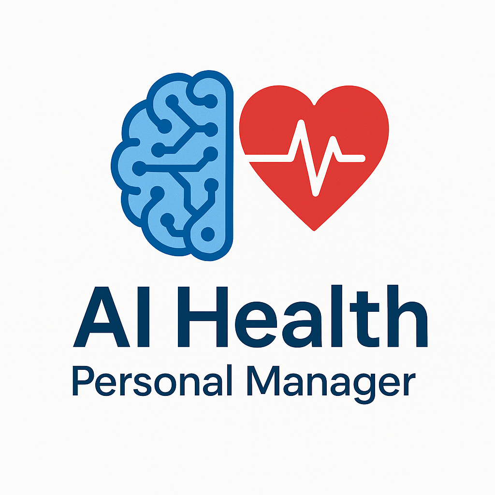

# 🧠 AI Personal Health Manager

Welcome to the **AI Personal Health Manager**, an intelligent and secure platform designed to help users manage and track their personal health data efficiently using a modern, interactive interface built with Streamlit.



---

## 🔍 Overview

The AI Personal Health Manager empowers individuals to:
- Track health metrics
- Manage medical documents
- Schedule appointments
- Monitor medications
- Visualize health trends

All while keeping data secure and user access authenticated.

---

## 🚀 Features

✅ Secure Login & Registration using `streamlit-authenticator`  
✅ User-specific dashboard  
✅ Health trend visualizations  
✅ Medication and appointment tracking  
✅ Upload and view medical documents  
✅ SQLite3-based database backend  
✅ Clean UI built with Streamlit

---

## 🧪 Tech Stack

- **Frontend:** Streamlit  
- **Backend:** Python  
- **Database:** SQLite3  
- **Authentication:** streamlit-authenticator  
- **Version Control:** Git & GitHub

---

## 🔧 Installation

### 1. Clone the repository

```bash
git clone https://github.com/Srilaxmigavvalapally/AI_Personal_Health_Manager.git
cd AI_Personal_Health_Manager


